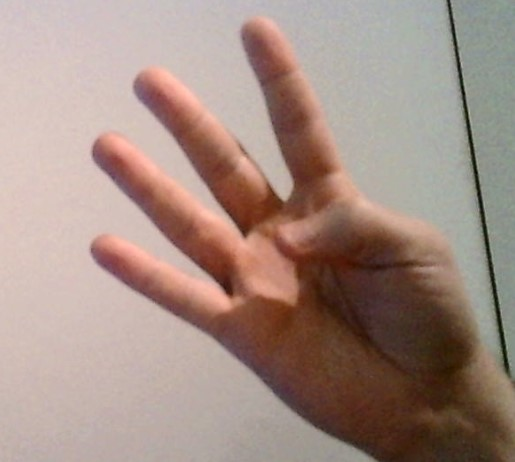
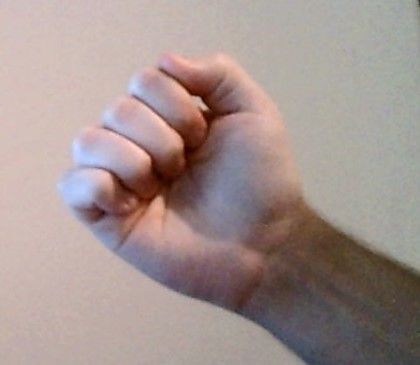
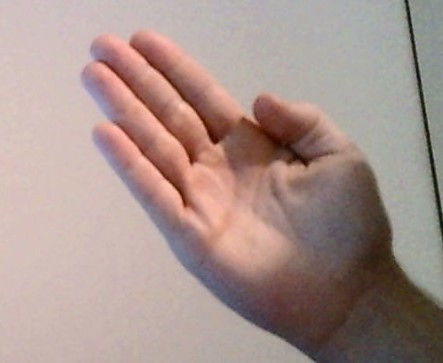
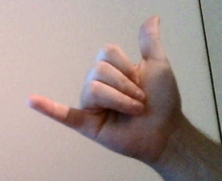
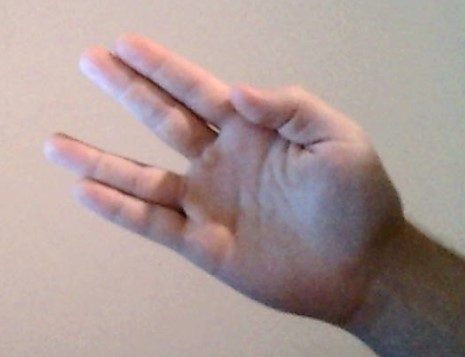
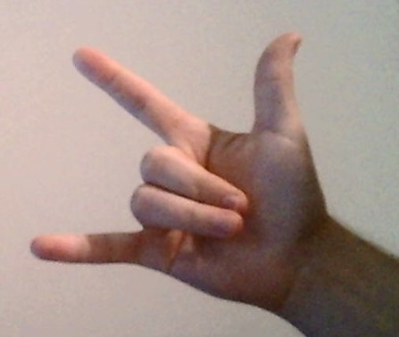

# Finger Count

Simple calculator built with OpenCV and Python3 that uses one hand gestures as input for the calculations.

Ran from `FingerCount.py`. Stopped by pressing "q".

## Base idea
* Simple calculator with input parsed from hand gestures.
* Small interval to combine numbers (wait until `COMBINE` sign).
* Hand should be in the yellow area (in roi window), in a way that fist barely touches the lines.

## Prerequisites
* Python3
* OpenCV
* Webcam with;
  * static background,
  * automatic focusing turned off (this is done from code as well).

## Gestures

| Gesture        | Result        | Example  | Image  |
| :------------- |:-------------:| :-----:| :-----:| :-----:|
| 1-5 fingers up | sum of fingers | Pretty self explanatory | 
| Fist     | 1st finger sum + 2nd finger sum     |  3 fingers > **FIST** > 5 fingers = 8 |  |
| Palm | 1st fingers, 2nd fingers      |    3 fingers > **PALM** > 5 fingers = 35 |  |
| "Call me" hand sign |  plus operation     |   first number + second number |  |
| "Vulcan salute" (without thumb) |  minus operation     |   first number - second number |  |
| "Rock on!" hand sign |  calculate     |   trigger calculation of built sequence |  |

## TODO
### Overall
* Better calculation support (currently uses only `fingerSum` and `fingerAppend`)
* More/better validations for crash prevention
* Add images for gestures
* More gestures
* Overall code cleanup..
* Folders
* Sample video(s)

### Gestures:
* `1-5` count of fingers
* fist for `COMBINE` gesture, e.g. 3+5 = 8 - parsed with some small interval 3s, or something
* something as `+` & `-` gestures
* something as `/` & `*` gestures
* `NEXT` gesture, e.g. 3 -> "next" -> 6 = 36
* something as `CALCULATE` gesture
* `RESET` and `REWIND` gestures